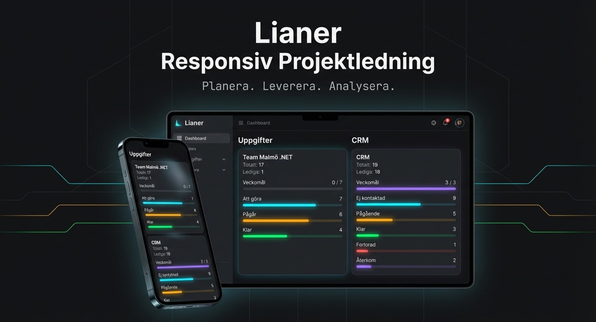
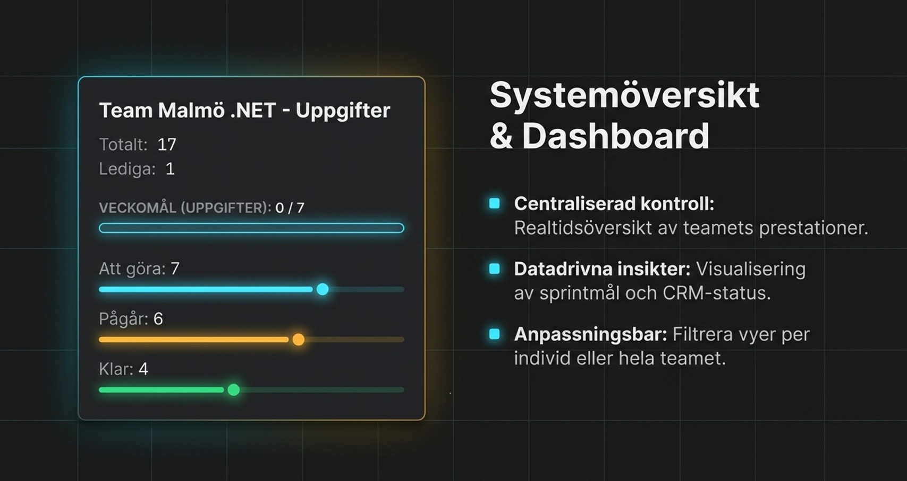
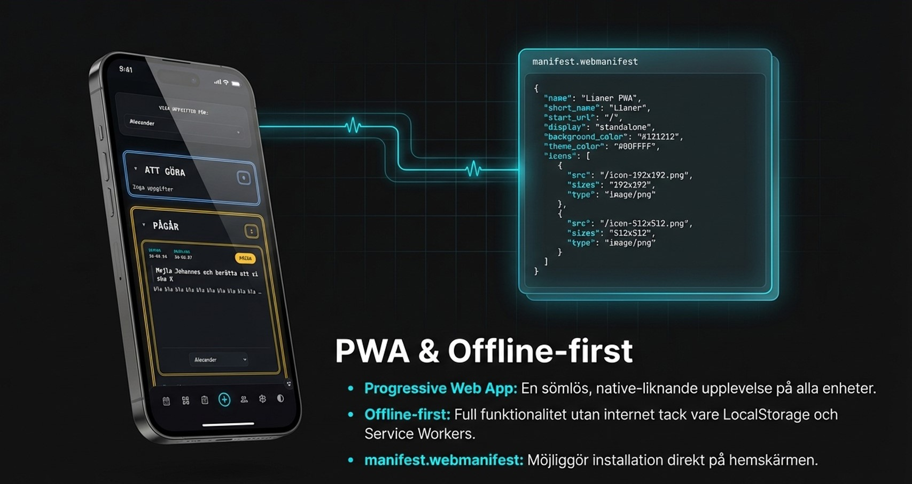
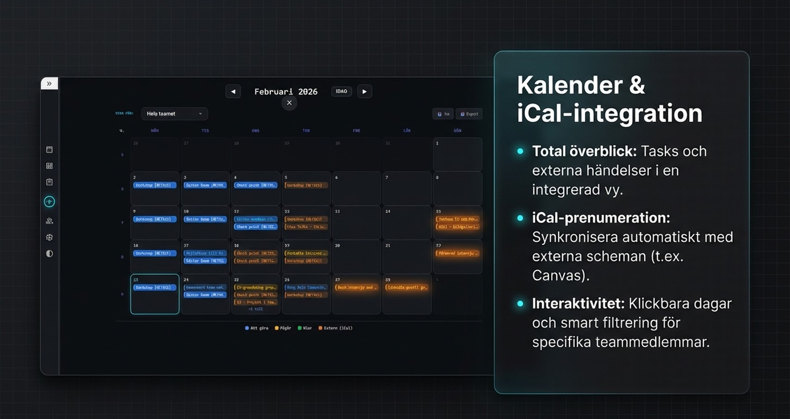
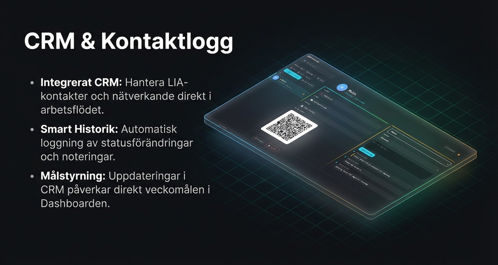
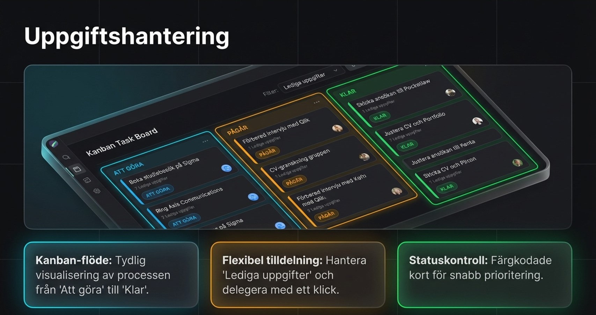
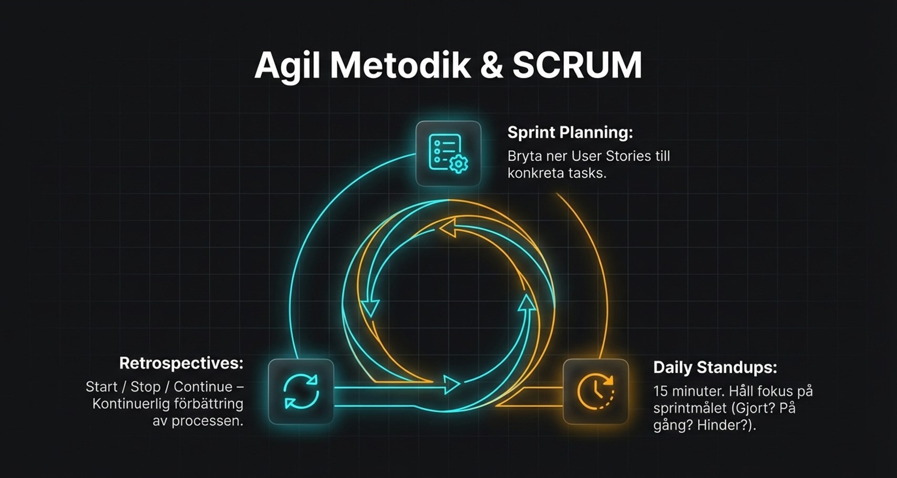
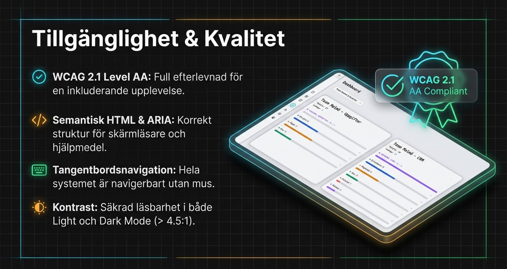
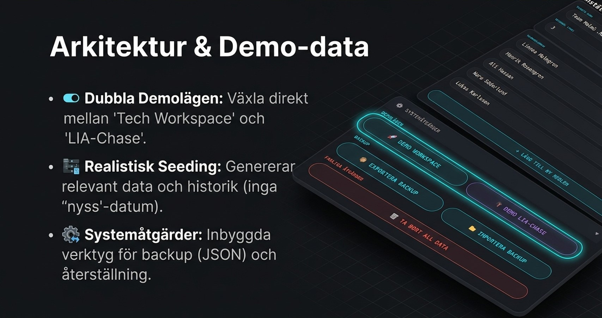

# <p align="center">Lianer - Project Planner</p>

<p align="center">
  
</p>

<p align="center">
  <strong>A modern project planner built with Vanilla JavaScript for educational purposes.</strong>
</p>

---

https://alexanderjson.github.io/K3---Projekt-i-team/

## Description

Lianer allows teams to collaborate effectively using a classic **SCRUM-board** structure. Users can add team members, assign tasks, and track real-time progress through an intuitive dashboard interface.

---

## Table of Contents

- [Description](#description)
- [Technologies](#technologies)
- [Features](#features)
- [Installation & Usage](#installation--usage)
- [Testing & Quality Assurance](#testing--quality-assurance)
  - [Running Tests](#running-tests)
  - [Continuous Integration](#continuous-integration)
- [Deployment](#deployment)
- [Bugs](#bugs)
  - [Unsolved Bugs](#unsolved-bugs)
- [Content](#content)
- [Typography](#typography)
- [Contributors](#contributors)
- [Repository Stats](#repository-stats)
- [Demo & Gallery](#demo--gallery)

---

## Technologies

| Component    | Technology        | Badge                                                                                                                   |
| :----------- | :---------------- | :---------------------------------------------------------------------------------------------------------------------- |
| **Language** | JavaScript (ES6+) |                |
| **Styling**  | CSS               |                            |
| **Storage**  | Local Storage     | . |
| **Dev Ops**  | GitHub Pages      |              |

---

## Features

- **Responsive Navigation**
  - Featured on all pages with a mobile-friendly toggle.
  - Active page indicators to improve user orientation.
  - High-contrast accessibility (Black on White).

<p align="center">
  
</p>

- **Dashboard**
  - **Project overview:** Visual overview of current project health.
  - **Individual overview:** Individual progress bars for team members to identify bottlenecks. The statusbars also also informs the user about teammembers individual progress.

- **Task Board**
  - **Task Management:** View locked and unlocked tasks.
  - **Assignment:** Streamlined workflow allowing members to self-assign based on capacity.
  - **Communication:** Locking tasks requires a mandatory comment, ensuring follow-up is documented.

---

## Installation & Usage

För att köra detta projekt lokalt på din maskin, följ dessa steg:

### Förutsättningar

Eftersom detta är en helt klientbaserad applikation krävs ingen specifik backend-server, men det underlättar att ha en lokal utvecklingsserver för att Serve:a filerna korrekt (speciellt för PWA/Service Workers och `manifest.webmanifest`).

- [Node.js](https://nodejs.org/en/) & npm (för att kunna installera beroenden samt köra tester).

### Steg för steg

1. **Klona repot**
   Klipp in detta i din terminal för att ladda ner koden:
   ```bash
   git clone https://github.com/AlexanderJson/K3---Projekt-i-team.git
   ```
2. **Navigera in i mappen**
   ```bash
   cd K3---Projekt-i-team
   ```
3. **Installera NPM-paket**
   Detta steg krävs främst för testning (Jest):
   ```bash
   npm install
   ```
4. **Kör projektet lokalt**
   Du kan öppna `index.html` direkt i webbläsaren, ELLER köra den via en lokal server (rekommenderas).
   Om du exempelvis använder VS Code kan du starta **Live Server**.
   Alternativt, använd `npx serve`:
   ```bash
   npx serve .
   ```
   Öppna sedan din webbläsare och gå till `http://localhost:3000` (eller den port din server anger).

---

## Testing & Quality Assurance

- **Browsers:** Verified compatibility in Google Chrome, Mozilla Firefox, and Safari.
- **Responsiveness:** Validated using Chrome DevTools device simulation for mobile, tablet, and desktop.
- **Code Standards:** - **HTML:** Passed W3C Validator.
  - **CSS:** Passed Jigsaw Validator.
  - **Performance:** Audited via Lighthouse for SEO and accessibility.
  - **Unit tests:** Code is tested with Jest

### Running Tests

To verify the project integrity, run the following command:

```bash
npm test
```

### Continuous Integration

We use **GitHub Actions** to automate our testing pipeline. On every `push` and `pull_request` to the `main` branch:

1.  The environment is initialized.
2.  Dependencies are installed via `npm install`.
3.  **Jest** runs the full unit test suite.

**Note:** Merging is blocked if the CI pipeline fails, ensuring the production build remains stable.

---

## Deployment

The project is live and hosted via GitHub Pages.
**[Visit the Live Site](https://alexanderjson.github.io/K3---Projekt-i-team/)**

---

## Bugs

### Unsolved Bugs

## Content

- The icons in the footer were taken from [Google Fonts](https://fonts.google.com)

## Typography

- The fonts were taken from [Google Fonts](https://fonts.google.com/)

---

## Contributors

This project was developed by:

| [<h3>@alexanderjson</h3>](https://github.com/alexanderjson) | [<h3>@exikoz</h3>](https://github.com/exikoz) | [<h3>@JocoBorghol</h3>](https://github.com/JocoBorghol) |
| :---------------------------------------------------------: | :-------------------------------------------: | :-----------------------------------------------------: |

---

### Repository Stats


---

## Demo & Gallery

Här följer en visuell genomgång av applikationen, dess gränssnitt och funktioner.

### Pitch & Slide

<p align="center">
  
  <br><em>PWA & Offline-first funktionalitet</em>
</p>
<p align="center">
  
  <br><em>Kalender med Veckonummer & .ics export</em>
</p>
<p align="center">
  
  <br><em>Integrerat CRM med QR-generering</em>
</p>
<p align="center">
  
  <br><em>Avancerad Uppgiftshantering (Kanban)</em>
</p>
<p align="center">
  
  <br><em>Agila Verktyg & SCRUM-stöd</em>
</p>
<p align="center">
  
  <br><em>WCAG 2.1 AA Tillgänglighetsstandard</em>
</p>
<p align="center">
  
  <br><em>Arkitektur, Demolägen och Datasäkerhet</em>
</p>

### Screenshots från Applikationen

**Dashboard:**

<p align="center">
  
</p>
<p align="center">
  
  &nbsp;&nbsp;&nbsp;&nbsp;
  
</p>

**Taskboard / Uppgiftshantering:**

<p align="center">
  
</p>
<p align="center">
  
</p>
<p align="center">
  
  &nbsp;&nbsp;&nbsp;&nbsp;
  
</p>

**CRM & Planering:**

<p align="center">
  
</p>
<p align="center">
  
</p>

---
