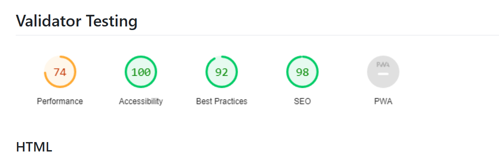

# Lianer

A project planner made to aid students in finding LIA together. 
Users of this website can add teammembers and track project progress with
a classic scrum-board structure. This site is targeted for both companies and individuals
who are looking for a tool to implement project management strategies and better
communication.

## Features

- **Navigation Bar**

  - The navigation bar is featured on all pages and is fully responsive. 
  - The black font of the menu items 
    contrasts to the white background, making it more accessible. 
  - The navigation bar also contains a logo that links to the homepage and links to each section of the website. 
  - An underscore appears underneath the active link, to show the user which page they are on. 

- **Dashboard**

  - This section features an overview of the projects current progress. 
  - The statusbars also also informs the user about teammembers individual progress.

- **Tasks**

  - The tasks section allows the user to see the projects locked and unlocked tasks. 
  - By using the SCRUM board structure, the user can effeciently track the projects current
    trajectory and progress. 
  - A task can be assigned to any teammember which streamlines the workflow as team members self-assign based on their capacity. 
  - Tasks can be locked with a required comment, this ensures that communication and follow-up remain central to the workflow. 

## Features Left to Implement

- Schedule

# Testing
- The site has as of (2026-02-17) been tested in the following browsers:  Google Chrome, Internet Explorer and Mozilla Firefox.
- Responsiveness has been tested with Chrome devtools device toolbar.
- Unit tests and CI/CD has been used to ensure that the code quality is always up to standard when merged.
 

## Validator Testing

### HTML
No errors were returned when passing through the official W3C validator.
### CSS
No errors were found when passing through the official (Jigsaw) validator.

## Bugs

### Unsolved Bugs
The navigation bar switches positions slightly at different screen sizes. Media queries have not helped. 

# Deployment
- The site was deployed to Github Pages. 
  The live link can be found [here](https://linear.app/)

## Content

- The icons in the footer were taken from [Google Fonts](https://fonts.google.com)

## Typography
- The fonts were taken from [Google Fonts](https://fonts.google.com/)
